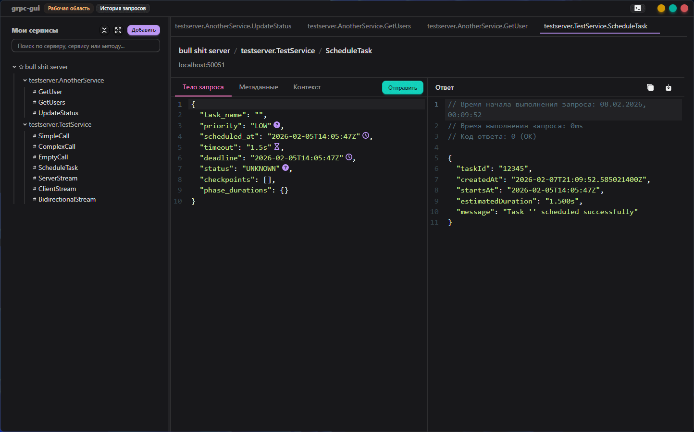
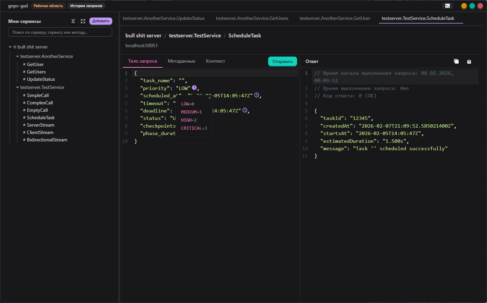
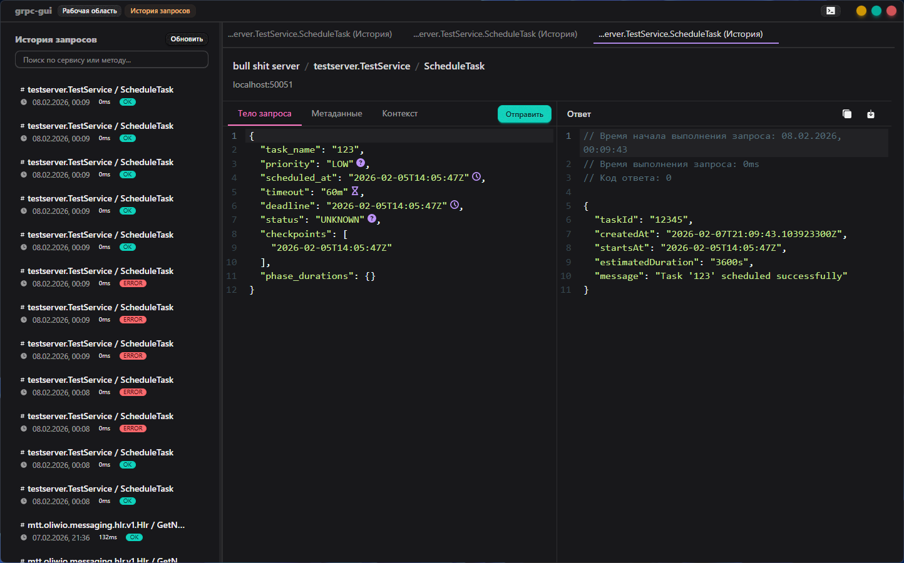

# grpc-gui

GUI клиент для gRPC серверов с рефлексией.

## Че это

Подключаешься к gRPC серверу с включенной рефлексией, достаешь все методы, сервисы и можешь их вызывать через нормальный интерфейс.

## Фичи

- Подключение к серверам с gRPC рефлексией
- Автоматическое определение всех сервисов и методов
- JSON редактор для запросов с подсветкой
- Помощники для well-known типов:
  - Timestamp - выбор даты/времени через календарь
  - Duration - вбиваешь в нормальном виде типа "1h30m"
  - Enum - выбор из списка значений
- История запросов
- TLS/SSL поддержка
- Кеширование рефлексии (не дергает сервер каждый раз)

## Скриншоты

### Отправка запроса



### Помощники для Timestamp


### Помощники для Enum



### История запросов



## Установка

Скачай последний релиз:

- Windows: `grpc-gui.exe` (portable) или `grpc-gui-amd64-installer.exe`
- macOS: `grpc-gui.dmg`

## Для разработки

Требуется:

- Go 1.22+
- Node.js 22+
- Wails v3

```bash
# Установить wails
go install github.com/wailsapp/wails/v3/cmd/wails3@latest

# Запустить dev режим
wails3 dev

# Собрать
wails3 package
```

## Релизы

Используется semantic-release с conventional commits:

- `feat:` - новая фича (minor bump)
- `fix:` - баг фикс (patch bump)
- `feat!:` или `BREAKING CHANGE:` - breaking change (major bump)

```bash
git commit -m "feat: добавил кеширование рефлексии"
git push
```

Релиз создастся автоматически.

## Лицензия

Да похуй ваще, делайте что хотите
